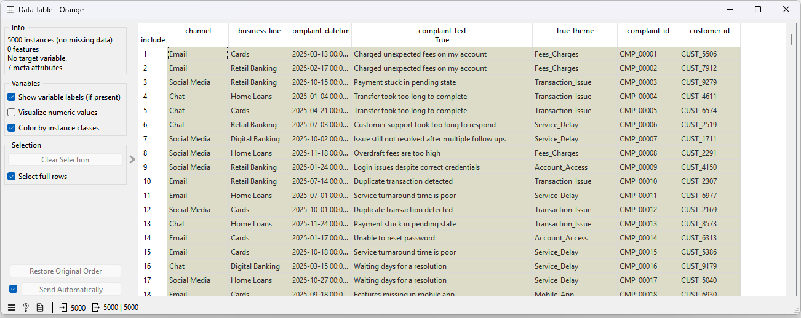
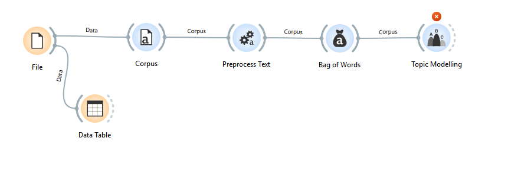
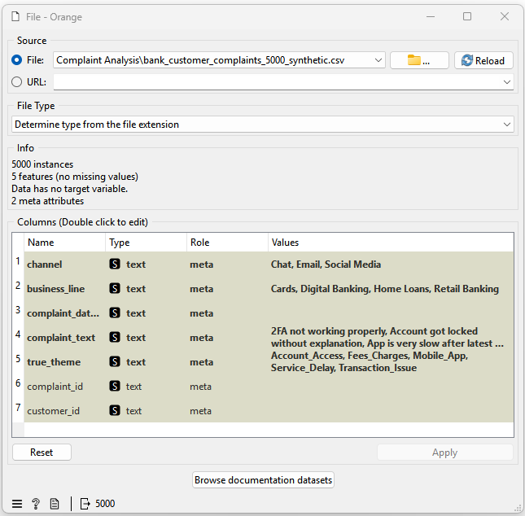
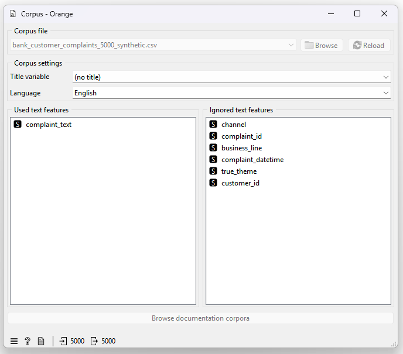
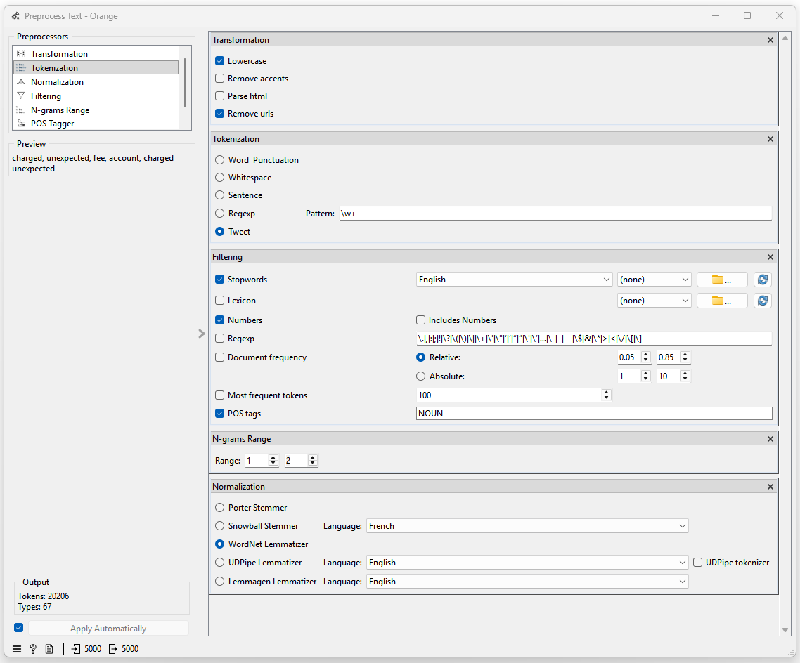
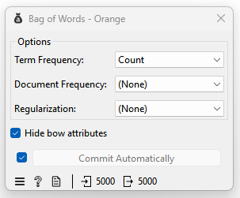
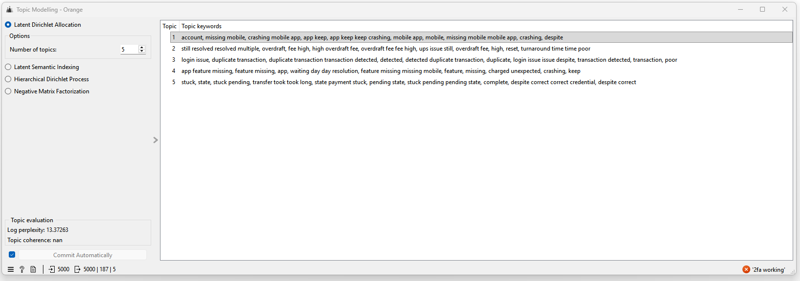

# Complaint Analysis Using NLP in Orange 3
### Identifying Customer Pain Points in a Banking Environment

---

## 1. Problem Statement

Banks receive a high volume of customer complaints through multiple channels such as:
- emails,
- chat interactions, and
- social media platforms.

These complaints are typically stored as **unstructured free text**, making it difficult to:
- identify recurring issues,
- spot systemic control weaknesses,
- and independently validate management’s complaint summaries.

From an **audit perspective**, analysing complaints manually or via sampling can result in:
- biased conclusions,
- missed emerging risks,
- and lack of population‑level insight.

This project demonstrates how **Natural Language Processing (NLP)** can be used to analyse customer complaints at scale and identify **prevailing complaint themes** using Orange 3.

---

## 2. Audit Ask

> **What are the dominant customer pain points emerging from customer complaints across channels, and do they indicate systemic issues requiring audit attention?**

---

## 3. Objective

The objectives of this analysis are to:

- Analyse 5,000 customer complaints provided in unstructured text form.
- Use NLP techniques to identify dominant complaint themes.
- Aggregate complaints into interpretable, business‑relevant issue categories.
- Provide audit‑ready evidence to support risk assessments and audit planning.

---

## 4. Data Overview

### Dataset
A synthetic dataset representing **5,000 customer complaints** was used.

Each row corresponds to one complaint received by the bank.

### Key Fields

| Column | Description |
|------|------------|
| complaint_id | Unique identifier of the complaint |
| customer_id | Synthetic customer identifier |
| channel | Source of complaint (Email / Chat / Social Media) |
| business_line | Product or service area |
| complaint_datetime | Date complaint was received |
| complaint_text | Free‑text complaint description |
| true_theme | Ground‑truth theme (used only for validation) |

   
Figure 1: Sample Data.

> **Note:** The `true_theme` column is included only for learning and validation purposes. In real audit scenarios, themes would be discovered without prior labels.

---

## 5. Methodology Overview

The analysis was conducted using **Orange 3 with the Text Mining add‑on**, following a structured NLP pipeline:

   
Figure 2: Overall Workflow.

---

## 6. Step‑by‑Step Analysis

### Step 1 – File & Corpus Creation

The complaint CSV file was first loaded using the **File** widget to explicitly define column roles.

The **Corpus** widget was then used to convert each complaint into a document suitable for text analysis.

#### Why this step is important
- Corpus ensures Orange treats each complaint as a separate document.
- Only relevant text (`complaint_text`) is used for NLP, while metadata is retained for investigation and traceability.

 
 
Figure 3: File and Corpus Configuration

---

### Step 2 – Text Preprocessing

The **Preprocess Text** widget was configured to clean and normalise the complaint text.

#### Key preprocessing choices and rationale

- **Lowercase**  
  Ensures consistency and avoids duplicate tokens due to casing.

- **Remove URLs**  
  Eliminates noise from complaint text sourced from digital channels.

- **Tweet Tokeniser**  
  Handles short, informal and conversational text typical of complaints.

- **Stopword Removal (English)**  
  Removes grammatical filler words (e.g. “the”, “and”, “my”).

- **Remove Numbers**  
  Prevents reference numbers and dates from becoming artificial topics.

- **POS Tagging (NOUN)**  
  Retains nouns, which carry the most semantic meaning (e.g. *fees*, *transaction*, *app*, *account*).

- **N‑grams (1–2)**  
  Preserves multi‑word complaint concepts such as:
  - *unexpected fee*
  - *account access*
  - *payment stuck*

- **Lemmatisation (WordNet, English)**  
  Normalises variations of the same word into a common base.

 
Figure 4: Preprocess Text Configuration

---

### Step 3 – Bag of Words

The **Bag of Words** widget transformed the processed text into a document‑term matrix.

#### Configuration rationale
- **Term Frequency = Count**  
  Appropriate for topic modelling and easier to explain to audit stakeholders.
- No TF‑IDF or regularisation applied, as LDA performs best on raw counts.

 
Figure 5: Bag of Words Configuration

---

### Step 4 – Topic Modelling

The **Topic Modelling** widget was applied using **Latent Dirichlet Allocation (LDA)**.

#### Model configuration
- Algorithm: LDA
- Number of topics: **5**

#### Why 5 topics?
- Aligns with expected major banking complaint categories.
- Produces fewer, stronger, and audit‑defensible themes.
- Avoids artificial fragmentation of issues.

 
Figure 6: Topic Modelling Configuration

---

## 7. Identified Complaint Themes

Based on the topic keywords, the following dominant themes were identified:

### Topic 1 – Mobile & Digital Banking Failures
- Mobile app crashing
- Missing features
- App instability affecting account access

**Audit interpretation:**  
Digital resilience and change management risks in the mobile banking platform.

---

### Topic 2 – Fees & Charges Disputes
- Unexpected fees
- High overdraft charges
- Poor complaint resolution turnaround time

**Audit interpretation:**  
Conduct risk related to fee transparency and complaint handling effectiveness.

---

### Topic 3 – Transaction Integrity Issues
- Duplicate transactions
- Transaction detection errors
- Login‑related transaction issues

**Audit interpretation:**  
Potential weaknesses in transaction processing and reconciliation controls.

---

### Topic 4 – Product Feature Defects
- Missing app features
- Unexpected charging behaviour
- Post‑release functional issues

**Audit interpretation:**  
End‑to‑end testing gaps and release governance concerns.

---

### Topic 5 – Pending & Stuck Payments
- Payments stuck in pending state
- Transfers taking unusually long
- Valid credentials but incomplete transactions

**Audit interpretation:**  
Risks in payment processing reliability and exception handling.

---

## 8. Overall Workflow Summary
   
Figure 2: Overall Workflow.

---

## 9. Interpretation & Audit Insight

The complaint analysis demonstrates that:

- Customer complaints cluster into a small number of **recurring, systemic themes**.
- Issues are not isolated incidents but indicate **process and control weaknesses**.
- Digital banking stability, transaction processing and fees handling represent **key areas of customer detriment**.

From an audit perspective, these insights can be used to:
- inform risk assessments,
- prioritise audit coverage,
- challenge management summaries,
- and assess remediation effectiveness over time.

---

## 10. Summary

This exercise illustrates how NLP‑based complaint analysis can:

- transform unstructured complaint data into structured insights,
- reveal dominant customer pain points at scale,
- and provide objective, data‑driven evidence for audit and risk functions.

Orange 3 provides a transparent and explainable platform for performing such analysis, making it well‑suited for audit and governance use cases.

---

## Disclaimer

All data used in this analysis is **synthetic** and intended solely for demonstrations and learning purposes.
